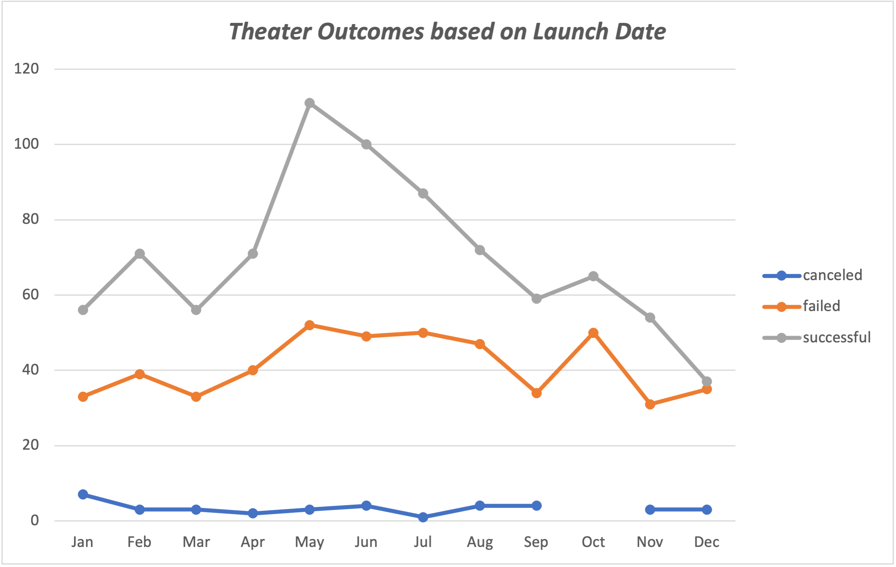

# An Analysis of Kickstarter Campaigns - Analyzing the Success of Theatre Campaigns
## Overview of Project
After nearly funding her play *Fever* using Kickstarter, Louise's presented us with a problem: How well did her play fair against theater/play campaigns.
## Purpose
We are analyzing two items to provide additional context
  1. How did theater campaigns do dependent on the start date of the fundraising?
  2. How successful were plays based on their fundraising Goal
## Analysis and Challenges
A few items of note when reviewing the provided data:
- In order to find the Theater outcomes by Launch date, we needed to convert from there store date code to a usable function:
  - Take the cells in Column J and use `<=(((J2/60/60)/24)+DATE(1970,1,1))>` to find the correct start date
  - Remove all sub-date categories out of the *Axis* Pivot Chart Field
  - Remove Live from the Row Labels filter
- To correctly capture all succesful and failed outcomes assigned to playes, make sure to have all factors of your excel function, or the results will be skewed
  - `countifs()` is the best option
  - If you do not use the correct greater than/less than/equals combination, you will not be capturing all items in a range. ex.) All items in a range of 1000 to 4999 Successful plays would code as follows: `=COUNTIFS('Kickstarter -Data'!$F:$F,"successful",'Kickstarter -Data'!$D:$D,">=1000",'Kickstarter -Data'!$D:$D,"<=4999",'Kickstarter -Data'!$R:$R,"plays")`

## Results
- Outcomes for Kickstarter Playes Based On Goals

  - The best month for starting a campaign was May  

* This project was practice work using a data set as part of the Data Analytics Bootcamp at Rice University
